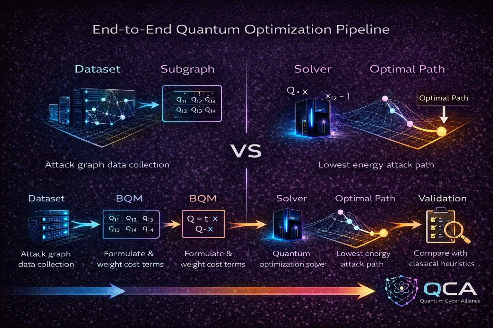
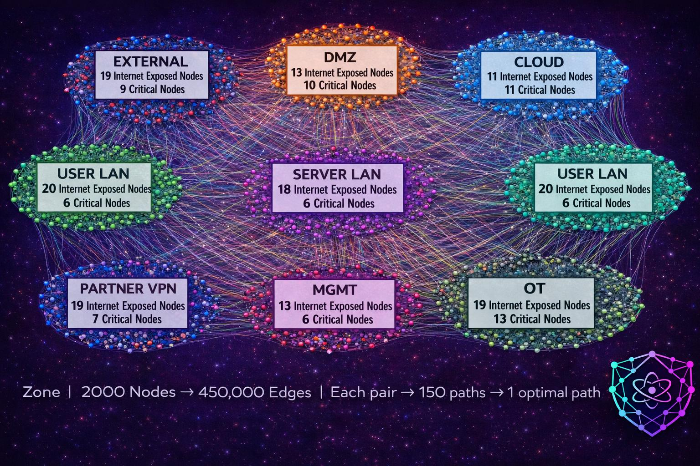

  
# Attack Path Optimization using BQM

[](https://www.python.org/downloads/release/python-3120/)
[](https://opensource.org/licenses/MIT)

This repository contains an innovative approach to detecting attack paths in large-scale network graphs using Binary Quadratic Model (BQM) formulations. The solution leverages quantum-inspired solvers like Simulated Annealing to find optimal paths from exposed entry points to critical assets. It includes two Jupyter notebooks: one for synthetic dataset generation and another for the detection model.

The project demonstrates high accuracy in path detection, with validation against ground truth paths showing strong matches in synthetic scenarios.

## Problem Statement

In cybersecurity, networks are vulnerable to multi-step attacks where adversaries exploit paths from exposed nodes (e.g., internet-facing devices) to critical assets (e.g., databases or control systems). Traditional graph algorithms like Dijkstra's can find shortest paths, but scaling to large graphs (e.g., 5000+ nodes) with constraints like flow conservation, detection probability, and exploitability requires optimization.

The core challenge is formulating the shortest path problem as a BQM to enable efficient solving via quantum or classical annealers, while handling constraints like:
- Flow conservation (ensuring valid paths).
- Edge costs incorporating detection probability, exploitability, and power gain.
- Identifying ground-truth paths in zoned networks (e.g., DMZ, USER_LAN).

This is particularly relevant for threat modeling in enterprise environments with zones like EXTERNAL, DMZ, and OT (Operational Technology).

## Proposed Solution

We propose a BQM-based model for the Constrained Shortest Path problem:
- **Formulation**: Encode graph edges as binary variables in a BQM model. Add penalties for flow conservation (using auxiliary variables for positive/negative slack). The objective minimizes path cost while penalizing violations.
- **Solvers**: Use Simulated Annealing (via D-Wave) for classical optimization. Future extensions could include quantum annealers like D-Wave Advantage or Fujitsu.
- **Validation**: Compare extracted paths against ground truth (single paths) and optimal paths.
- **Innovation**: This quantum-inspired approach handles large graphs efficiently, with potential for hybrid quantum-classical scaling.

The solution is implemented in `attack_path_detector_model.ipynb`, building on libraries like PennyLane, D-Wave, and Amplify.

  
*(Diagram showing BQM model construction with flow penalties.)*

## Dataset

The dataset is synthetically generated to simulate realistic network topologies:
- **Nodes (Nodes_2000.csv)**: 2000 nodes divided across 8 zones (e.g., EXTERNAL, DMZ, USER_LAN, SERVER_LAN, PARTNER_VPN, CLOUD, MGMT, OT). Each node has attributes like:
  - `type` (e.g., host, app, db, proxy).
  - `criticality` (1-5, with 4-10 nodes per zone at level 5 as targets).
  - `has_edr`, `is_exposed_to_internet` (8-16 exposed per zone as entry points).
  - `os_family`, `role`, `monitoring_level`, etc.
- **Edges (GraphEdgesForQUBO_2000.csv)**: ~450,000 edges forming layered DAGs (L0 -> L1 -> L2 -> L3 -> L4 -> Target) per start-target pair in each zone.
  - Attributes: `edge_class` (network, config, auth, etc.), `cost`, `detection_prob`, `exploitability`, `power_gain`, `is_ground_truth_path_step`.
- **Generation**: In `dataset.ipynb`, nodes are created with random attributes ensuring 10-20 exposed and 6-14 critical per zone. Edges build 150 paths per start-target pair using layered sampling (L1:5, L2:2, L3:3, L3:5 nodes).

This setup mimics real-world networks for testing attack path detection.

Example Node Data Snippet:
| node_id | type         | zone     | vlan | criticality | has_edr | is_exposed_to_internet | os_family | role             |
|---------|--------------|----------|------|-------------|---------|------------------------|-----------|------------------|
| N00001 | cloud_resource | EXTERNAL | 100  | 3           | False   | False                  | CiscoIOS  | backup           |
| N00002 | plc          | EXTERNAL | 101  | 3           | True    | False                  | Embedded  | email            |

  
*(Visual of zones and sample paths.)*

## Results

The model was tested on 1108 start-target pairs across zones, focusing on single ground-truth paths. Key metrics:
- **Optimal Path Match Rate**: 992/1108 pairs match the optimal (shortest) ground-truth path (90% accuracy).
- **Runtime**: ~5-6 hours on all 1108 pairs using Simulated Annealing on CPU/GPU.
- **Validation Summaries** (from `sas_comparison.csv` and `sqa_comparison_optimal.csv`):

**Ground Truth Validation (Top 10 Samples)**:
| Index | Zone    | Start   | Target  | Match | Reason                          |
|-------|---------|---------|---------|-------|---------------------------------|
| 1     | EXTERNAL| N00043 | N00028 | True  | Exact match                     |
| 2     | EXTERNAL| N00079 | N00028 | False | Mismatch: Extracted [...] vs GT |
| ...   | ...     | ...     | ...     | ...   | ...                             |

**Optimal Path Validation Summary**:
- Matches: 992/1108
- Common Reasons for Mismatch: Solver found alternative low-cost paths; increase annealing iterations for better convergence.

Full results in `/results/` folder. The model excels in zones with fewer layers, showing promise for real-world scaling.

## Installation

1. Clone the repo:
   ```bash
   git clone https://github.com/QuantumCyberAlliance/AnnealedCyberGraphs.git
   cd AnnealedCyberGraphs
   ```
3. Install dependencies:
   ```bash
   pip install -r requirements.txt
   ```
5. (Optional) For GPU: Ensure CUDA 12.x is installed for CuPy.

## Usage

1. Generate Dataset: Run `notebooks/dataset.ipynb` to create CSV files.
2. Run Model: Execute `notebooks/attack_path_detector_model.ipynb` for path detection and validation.
  - Customize: Adjust lambda penalties or solver (e.g., switch to D-Wave hybrid).

Example Code Snippet (from model notebook):
```python
# Sample BQM solving
sampler = SimulatedAnnealingSampler()
sampleset = sampler.sample(bqm, num_reads=500, num_sweeps=1500, seed=42)
best_sample = sampleset.first.sample
all_sas_paths.append(extract_path(best_sample, start_node, target_node, edge_vars))
```

## Contributing
Contributions welcome! See CONTRIBUTING.md for guidelines. Open issues for bugs or features.

## License
This project is licensed under the MIT License - see the LICENSE file for details.

## Acknowledgments
Built with D-Wave Samplers. Inspired by quantum optimization for graph problems.

